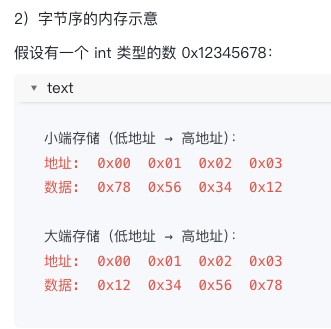

# 1 c语言的编译过程包含哪些阶段？
C 语言从源代码到可执行程序，需要经过预处理、编译、汇编、链接四个阶段：

预处理阶段处理以 ＃ 开头的预处理指令。包括展开宏定义 (#defne) 、处理条件编译 (#ifdef) ) 、包含头文件 (#include) 。预处理器会把头文件的内容复制到源文件中, 把

宏替换成实际内容。处理完成后生成i文件, 这是纯C代码, 没有预处理指令了。
编译阶段把预处理后的C代码翻译成汇编代码。编译器会做语法检查、语义分析、代码优化等工作。如果代码有语法错误, 这个阶段会报错。编译完成后生成.§文件, 里面是汇编语言。

汇编阶段把汇编代码翻译成机器码。汇编器会把汇编指令转换成二进制的机器指令, 生成.0或, obj 的目标文件。目标文件已经是机器码了, 但还不能直接执行, 因为可能引用了其他文件的函数。

链接阶段把多个目标文件和库文件组合成一个可执行文件。链接器会解析函数调用、变量引用, 把所有代码和数据整合在一起, 生成最终的可执行文件 (如 exe 或 a.out) 。

# 2 C 语言中 include <> 和 include "" 有什么区别？

#include <> 和 #include "" 都是用来包含头文件的预处理指令，区别在于查找头文件的路径顺序不同。

#include <>（尖括号）编译器会在**系统标准**路径下查找头文件。这些路径通常是编译器安装时配置好的，包括标准库头文件所在的目录。比如 #include <stdio.h> 会在系统目录（如 /usr/include）中查找 stdio.h。这种方式用于包含系统提供的标准头文件。

#include ""（双引号）编译器会先在**当前源文件所在目录**查找，如果找不到再去系统标准路径查找。比如 #include "myheader.h" 会先在源文件的同级目录找，找不到才去系统目录找。这种方式用于包含自己编写的头文件。

# 3 C 语言中 const 和 define 有什么区别？各自的应用场景是什么？

const（C 语言关键字）const 是 C 语言的关键字，定义的是只读变量。例如 const int MAX = 100，这会在内存中分配空间存储 100 这个值，只是这个变量不能被修改。const 有类型检查，编译器会检查类型是否匹配；而且 const 有作用域，在函数内定义的 const 变量只在函数内可见。


#define（预处理指令）#define 是预处理指令，在预处理阶段进行简单的文本替换。例如 #define PI 3.14，编译器会把代码中所有的 PI 替换成 3.14，就像查找替换一样。#define 定义的不是变量，只是一个文本替换规则，没有类型检查，也不占用内存空间。

# 4 C 语言中 static 关键字有哪些作用？
C 语言中的 static 关键字有三种主要用法，分别用于修饰局部变量、全局变量和函数。

1 修饰局部变量 ：static 会改变变量的生命周期和存储位置。
普通局部变量存于栈中，函数结束后销毁；
static 局部变量存于全局数据区，程序启动时分配、程序结束时销毁；
且 static 局部变量只初始化一次，函数多次调用时操作的是同一个变量，常用于计数器场景。

2 修饰全局变量 ：static 会限制变量的作用域。
普通全局变量在整个程序中可见，其他文件可通过 extern 访问；
static 全局变量只在当前文件内可见，其他文件无法访问，实现了文件级封装，避免命名冲突。

3 修饰函数static 同样限制函数的作用域。
static 函数只能在当前文件内调用，相当于文件的私有函数；
在大型项目中，不同文件可以有同名的 static 函数，互不干扰。

# 5 C 语言中 extern 关键字的作用是什么？如何使用？

extern 关键字用于声明一个变量或函数是在其他文件中定义的，告诉编译器 “这个东西存在，但不在这个文件里，链接时会找到”。
多文件变量共享在多文件项目中，如果一个全局变量在 file1.c 中定义，file2.c 想使用它，就需要用 extern 声明。
注意：extern 只是声明，不是定义，不会分配内存。定义只能有一次（在 file1.c 中），但可以有多个声明（在需要使用的文件中）。

# 6 C 语言中 sizeof 是函数还是运算符？它在什么时候计算？

sizeof 是运算符，不是函数。虽然使用时写成 sizeof(int) 很像函数调用，但它本质上是**编译时的运算符**。
计算时机：sizeof 在编译阶段就计算出结果，而不是在程序运行时。编译器会根据类型信息直接计算出字节数，然后把 sizeof 表达式替换成一个常量。比如 sizeof(int) 在编译时就被替换成 4（假设 int 是 4 字节），运行时不需要任何计算，因此 sizeof 的性能开销为 0。

特殊特性：由于 sizeof 是编译时计算的，它不会真正执行表达式。比如 sizeof(i++) 不会让 i 增加，只是计算 i 的类型占多少字节。这是很多人容易犯的错误，误以为 sizeof 会执行里面的代码。

# 7 c语言中 大端 小端 


大端（Big Endian）和小端（Little Endian）是多字节数据在内存中的存储顺序，用来规定：
多字节数值（比如 int 占 4 字节）的高位字节和低位字节，谁放在低地址、谁放在高地址。
举个例子：数值 0x12345678（4 字节）
大端：高位字节存低地址 → 内存顺序：12 34 56 78
小端：低位字节存低地址 → 内存顺序：78 56 34 12


你这段代码用了 ** 共用体（union）** 来判断字节序，核心是利用 union 所有成员共享同一块内存：
```c
union {
    int i;   // 4字节
    char c;  // 1字节，指向同一块内存的起始地址（低地址）
} test;

test.i = 1;  // 给int赋值1，二进制：0x00000001
return (test.c == 0);
```
小端模式：1 的低位字节 0x01 存在低地址 → test.c 读到 1 → 返回 0（假）
大端模式：1 的高位字节 0x00 存在低地址 → test.c 读到 0 → 返回 1（真）
所以这个函数的含义是：
返回 1 → 当前是大端
返回 0 → 当前是小端

三、为什么要区分大端 / 小端？
大端：符合人类阅读习惯（高位在前），常用于网络传输、嵌入式设备。
小端：符合 CPU 运算习惯（低位先处理），x86、ARM 等主流 PC / 手机 CPU 默认小端。
网络传输时必须统一用大端（网络字节序），所以跨平台 / 网络编程时要做字节序转换（htons/ntohl 等函数）。

四、补充记忆口诀
大端：高字节存低地址 → “高对低”
小端：低字节存低地址 → “低对低”
代码判断：给 int 赋值 1，看首字节是不是 0 → 是则大端，否则小端。

# 8 C 语言中 volatile 关键字的作用是什么？在什么场景下使用？

volatile 关键字告诉编译器 “这个变量可能会被意外改变，不要对它做优化”，简单说就是防止编译器自作聪明。
编译器优化代码时，如果发现一个变量在一段代码中多次读取但没有写入，可能会把变量值缓存在寄存器中，后续直接读寄存器而不是从内存读。这种优化通常没问题，但有些特殊情况下，变量的值可能被外部因素改变（如硬件、中断、其他线程），如果还读缓存的旧值就错了。
volatile 就是告诉编译器 “这个变量可能随时变化，每次使用都要从内存重新读取，不要优化”。这样能确保读到的永远是最新值。

使用场景：
多线程编程：多个线程共享的变量可能被其他线程修改
中断服务程序：中断处理函数可能修改某些标志变量
硬件寄存器：映射到硬件寄存器的变量，值由硬件改变

# 9 C 语言的数据类型有哪些？各占多少字节？
C 语言的数据类型可以分为基本类型、构造类型、指针类型、空类型四大类。
1. 基本类型
整型：
char：1 字节（有无符号版本，字节数相同）
short：2 字节
int：4 字节
long：4 或 8 字节（取决于系统）
long long：8 字节
每种整型都有 unsigned（无符号）版本，表示范围不同但字节数一致。
浮点型：
float：4 字节
double：8 字节
long double：8 或 16 字节（取决于系统）
2. 构造类型
包括数组、结构体（struct）、联合体（union）、枚举（enum）。它们的大小取决于具体定义，不是固定值。
3. 指针类型
32 位系统：统一 4 字节
64 位系统：统一 8 字节
无论指向什么类型，所有指针大小一致；void* 是通用指针，大小与其他指针相同。
4. 空类型
void 类型不占字节，主要用于修饰函数返回值、参数或通用指针。

# 10 C 语言中什么是指针？指针和地址有什么区别？

指针是一个用来存储变量的地址 可以用它直接访问内存中的数据

地址：是内存中的一个位置，就像门牌号一样，每个内存单元都有唯一的地址。


# 11 C 语言中指针和数组有什么关系？数组名是指针吗？

数组名在大多数情况下会自动转换（退化）为指向数组首元素的指针。
例如 int arr[10]，arr 通常等价于 &arr[0]，都是指向第一个元素的指针。
这就是为什么可以用指针来遍历数组：*(arr + i) 等价于 arr[i]


数组名不是指针变量，它是一个常量指针，不能被赋值或修改：
arr = arr + 1 是非法的（数组名不可修改）。
若定义 int *p = arr，则 p = p + 1 是合法的（指针变量可以修改）。
可以把数组名理解成一个不可修改的指针常量。

# 12 C 语言中什么是野指针？如何避免野指针？

野指针（Wild Pointer）是指指向未知内存区域的指针，是 C 语言中最危险的问题之一。
使用野指针会导致程序崩溃（段错误）或产生不可预测的行为。

1 指针未初始化：定义后未赋值，内部是随机地址值。
```c
int *p;  // p 是随机地址
*p = 100;  // 危险！可能崩溃
```
2 内存释放后继续使用：指针指向的内存被 free() 释放，但指针仍被使用。
```c
int *p = (int *)malloc(sizeof(int));
free(p);
*p = 100;  // 危险！p 指向的内存已释放
```

3 指向栈上局部变量：函数返回后，栈上局部变量的内存失效，指针仍指向该区域。
```c
// 情况3：返回局部变量地址
int* get_local() {
    int x = 10;
    return &x;  // 危险！x 是局部变量，函数返回后内存无效
}
```
避免野指针的方法：
1 指针定义时立即初始化，没有明确地址就初始化为 NULL
2 free 后立即把指针设为 NULL，防止重复使用
3 不要返回局部变量的地址
4 使用前检查指针是否为 NULL


# 13 C 语言中什么是悬空指针？和野指针有什么区别？

悬空指针（Dangling Pointer）是指指向已经被释放或已经不存在的内存的指针。它和野指针类似，都指向无效内存，但产生原因稍有不同。

悬空指针的产生：
通常产生于内存释放后。当你 free 一块动态分配的内存，或者函数返回后栈上的局部变量被销毁，但指向这些内存的指针还存在，这个指针就成了悬空指针。它指向的地址曾经有效，但现在无效了。

与野指针的区别：
野指针的范围更广，包括所有指向未知或无效内存的指针。未初始化的指针是野指针，悬空指针也是一种野指针。可以说悬空指针是野指针的一个子集，特指那些曾经有效、现在无效的指针。

# 14 C 语言中 malloc、calloc 和 realloc 有什么区别？

malloc、calloc 和 realloc 都是动态内存分配函数，但使用方式和特点不同。

malloc（memory allocation） ： 配合sizeof使用
最基础的内存分配函数，分配指定字节数的内存。它只管分配，不初始化，分配的内存里是随机值（垃圾数据）。使用时要指定字节数，通常用 sizeof 计算，比如 malloc(sizeof(int) * 10) 分配 10 个 int 的空间。

calloc（contiguous allocation）分配内存并初始化为 0。
它接受两个参数：元素个数和每个元素的字节数。比如 calloc(10, sizeof(int)) 分配 10 个 int 并全部初始化为 0。如果需要干净的内存，用 calloc 更方便，不用手动 memset。

realloc（re-allocation）
用于调整已分配内存的大小。它接受一个旧指针和新的大小，会尝试扩展或缩小内存。如果原位置后面有足够空间，就地扩展。如果没有，会分配新内存，复制数据，释放旧内存。realloc 可能返回新地址，所以要用返回值更新指针。

# 15 C 语言中什么是内存泄漏？如何检测和避免内存泄漏？

内存泄漏（Memory Leak）是指程序动态分配的内存没有被释放，导致内存无法回收，可用内存越来越少。长时间运行的程序如果有内存泄漏，最终会耗尽系统内存，导致程序崩溃或系统变慢。

常见原因
malloc/calloc 分配的内存忘记 free；
指针被覆盖，原来指向的内存无法释放；
条件分支中只有部分路径释放内存；
异常退出导致 free 没有执行。

避免内存泄漏的方法
每次 malloc 后，都要在对应的位置加上 free
函数有多个返回路径时，确保每条路径都释放了内存
使用工具检测（Valgrind、AddressSanitizer）
用智能指针或内存池等高级技术

# 16 C 语言中栈和堆有什么区别？各自的特点是什么？

